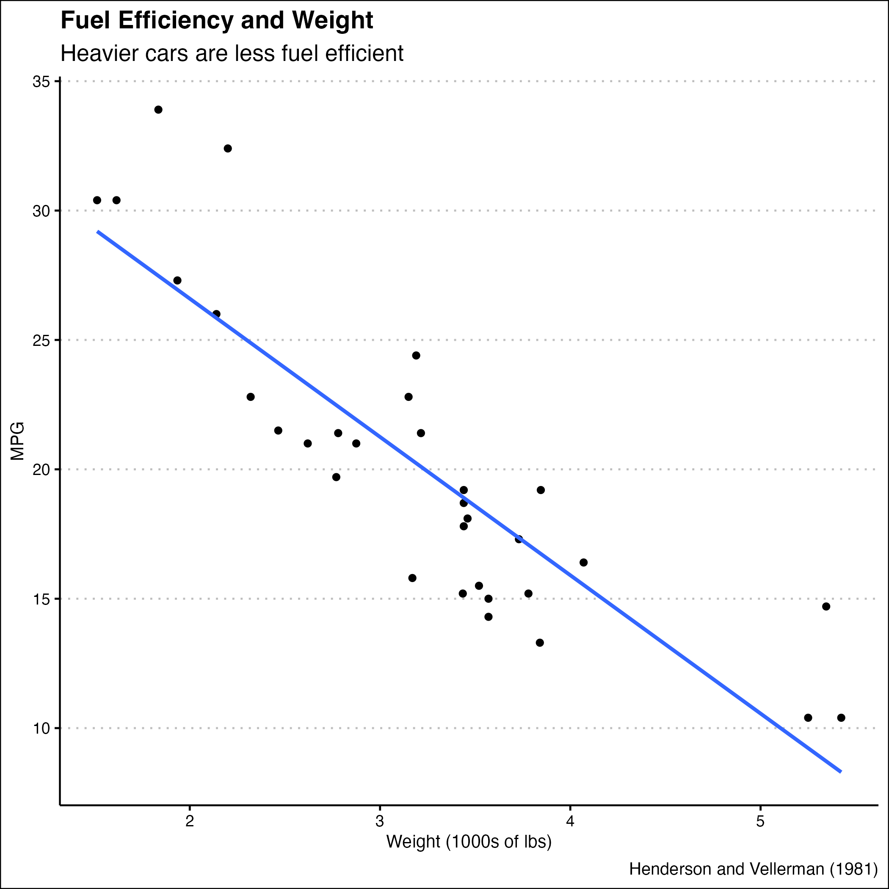

```{r setup, include=FALSE}
knitr::opts_chunk$set(echo = FALSE)

# Learn more about creating websites with Distill at:
# https://rstudio.github.io/distill/website.html

# Learn more about publishing to GitHub Pages at:
# https://rstudio.github.io/distill/publish_website.html#github-pages
library(tidyverse)
library(distill)
library(knitr)
```


```{r car_plot}
car_plot <- read_rds("car_plot.rds")
car_plot

ggsave("car-plot.png", plot = car_plot)

car_plot <- mtcars |> 
  select(mpg, wt) |> # I selected these two variables to make my new tibble not crowded and messy with not needed variables
  ggplot(mapping = aes(x = wt, y = mpg)) + 
  geom_point()+ 
  geom_smooth(method = "lm", formula = y~x, se = FALSE)+ 
  # I added the 'geom_smooth' so that there could be a trend line and we could visualize the data better
  theme_clean()+ 
  labs(title = "Fuel Efficiency and Weight", subtitle = "Heavier cars are less fuel efficient",y = "MPG", x = "Weight (1000s of lbs)", caption = "Henderson and Vellerman (1981)")
```
```{r image}

```


